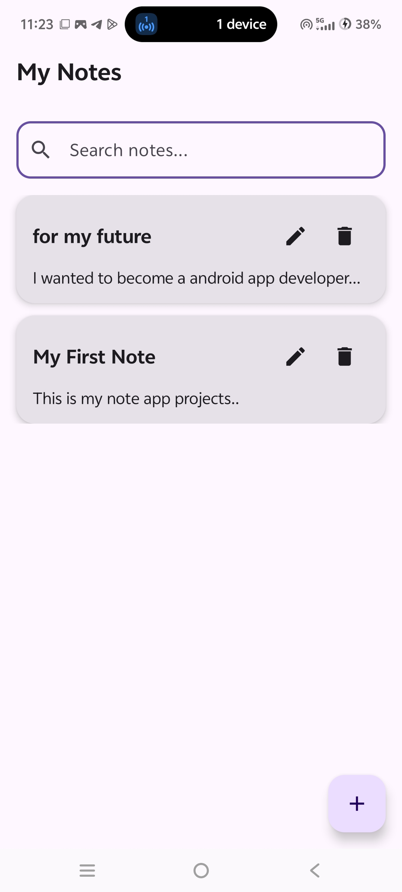
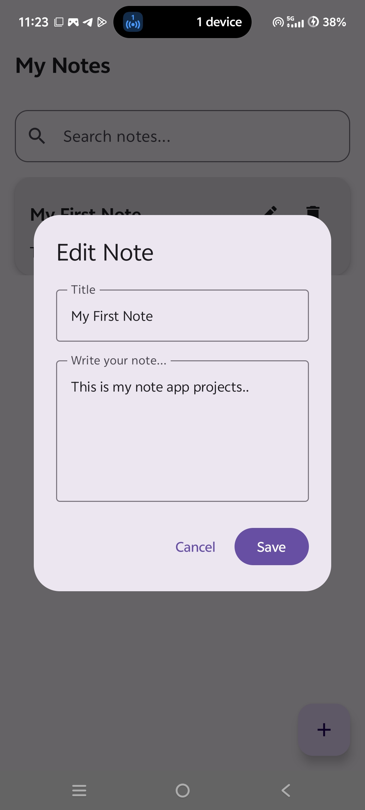

# 📝 NotesApp

A simple and professional Notes App built using Kotlin, Jetpack Compose, and Room Database.

## ✨ Features

- ➕ Add notes
- ✏️ Edit notes
- 🗑️ Delete notes
- 💾 Notes remain saved after restarting the app
- 🎨 Clean and modern UI
- 📱 Built for Android

## 🛠️ Technologies Used

- Kotlin
- Jetpack Compose
- Room Database
- Android Studio

## 📌 Project Status

Completed and fully functional.

## 👩‍💻 About

This project was created to practice Android app development using modern Android development tools and architecture.

## Screenshot 

### Notes App

